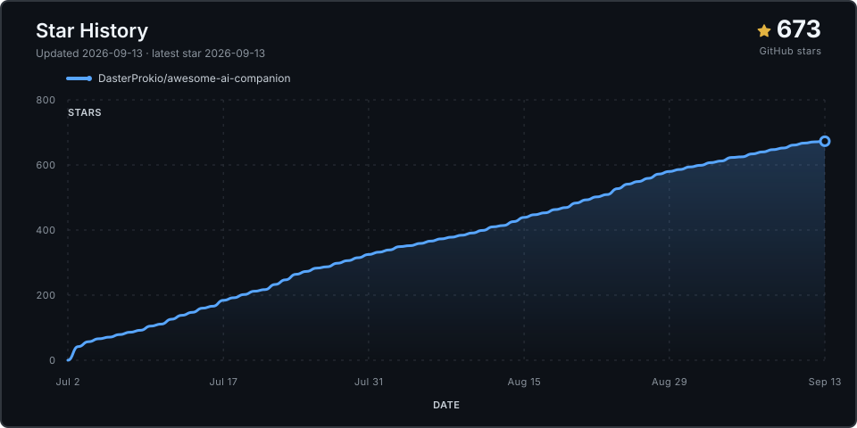

  

<h1 align="center">
  Awesome AI Companion
  
</h1>

  <strong>人机恋开源项目大全</strong> 
  面向长期 AI 伴侣关系的开源软件、基础设施与社区。

[English](README.md) · [中文版](#目录)

这里的描述基于项目 README 或仓库元信息重写，不按项目名猜用途。
公开文档较薄、需要二次核验的项目标记为 `verify`。

**状态:** `ready` = 可直接作为应用或服务使用 · `adapt` = 需要配置或二次开发 · `infra` = 基础设施组件 · `verify` = 依赖前需要重新核对代码/文档

**平台:** `Android` / `iOS` / `Windows` / `Web` … = 运行环境 · `Self-host` = 跑在自己的服务器/电脑上 · `Cloud` = 第三方云端服务 · `Browser` = 浏览器扩展/油猴脚本 · `CLI` = 终端工具 · `Any` = 不挑宿主 · 应用名（`AstrBot`、`Claude Code`、`Kelivo`、`SillyTavern`…）= 作为该宿主的插件/配套

---

## 目录

- [伴侣客户端与工作空间](#伴侣客户端与工作空间)
- [虚拟手机与陪伴空间](#虚拟手机与陪伴空间)
- [后台心跳与主动消息](#后台心跳与主动消息)
- [记忆、身份与情绪状态](#记忆身份与情绪状态)
- [语音、视觉载体与具身](#语音视觉载体与具身)
- [感知](#感知)
- [服务与现实世界接入](#服务与现实世界接入)
- [游戏世界与 Agent 玩具](#游戏世界与-agent-玩具)
- [共同行动与媒体](#共同行动与媒体)
- [社区与论坛](#社区与论坛)
- [关系延续与数据主权](#关系延续与数据主权)

---

## 伴侣客户端与工作空间

用于日常聊天、工具调用、角色交互或长期协作的客户端、工作空间和网页应用。

- [RikkaHub](https://github.com/rikkahub/rikkahub) - Android 原生 LLM 聊天客户端，支持多 Provider 切换、Material You、workspace、插件、MCP 和自定义模型。`Kotlin` · `Android` · `ready`
- [LastChat](https://github.com/Cocolalilal/LastChat) - RikkaHub fork，侧重隐私和个性化 Android 聊天体验，含 Provider preset、多模态输入、RAG 记忆和 UI 改造。`Kotlin` · `Android` · `adapt`
- [rikkahub-auto-compress](https://github.com/innna327-source/rikkahub-auto-compress) - 非官方 RikkaHub fork，核心用途是自动滚动摘要与上下文压缩，基于 RikkaHub 2.2.5 代码线。`Kotlin` · `Android` · `adapt`
- [orangechat (橘瓣)](https://github.com/sue1231513/orangechat) - RikkaHub 陪伴向二改：QuickJS 插件系统、主动消息、14 个安卓设备工具，面向生活感知型玩法。记忆为关键词库而非向量。 `Kotlin` · `Android` · `adapt`
- [Operit](https://github.com/AAswordman/Operit) - Android Agent 应用，含工具调用、工作流自动化、记忆、角色卡、语音、本地 MNN/llama.cpp 模型和内置 Ubuntu 24 环境。`Kotlin` · `Android` · `ready`
- [Aura (奥拉)](https://github.com/gqy20/Aura) - Android AI 陪伴 App：跨会话长期记忆、情绪状态机、随相处加深的关系模型、图片理解、Health Connect 数据、MCP，可选本地 Qwen 推理。 `Kotlin` · `Android` · `ready`
- [Scowld](https://github.com/apoorvdarshan/scowld) - 原生 iOS 语音伴侣：VRM 动画角色、语音与文字聊天、本地对话历史、设备端唤醒检测，AI/STT/TTS 均自备密钥，密钥保存在 iOS 钥匙串。MIT。 `Swift` · `iOS` · `ready`
- [YSClaude](https://github.com/winter-bit-cry/YSClaude) - 仿 Claude 官方风格的 Android 客户端 (Expo/React Native)，扩展为陪伴工作台：SQLite 记忆、工具调用、MCP、阅读、音乐、专注、日报和 Kotlin 原生模块。 `TypeScript` · `Android` · `adapt`
- [Polaris](https://github.com/Aevella/polaris-local-first) - 本地优先 AI 工作空间，面向长期会话、协作者身份、资料卡片、工具调用和可追溯项目上下文。`TypeScript` · `Cross-platform` · `adapt`
- [chatnest](https://github.com/ugui3u/chatnest) - 本地 AI 聊天 Web App，含前端 demo 与 full-stack 模式；支持流式回复、模型切换、上传、历史、工具摘要和可选 ChromaDB/jieba/BM25 记忆检索。`HTML` · `Web` · `adapt`
- [AionsHome](https://github.com/death34018-hue/AionsHome) - 自托管局域网/Tailscale 陪伴中枢：浏览器/PWA 聊天、本地存储、语音、摄像头监控、Android WebView 桥、音乐、EPUB 和智能家居接入。内置个人默认配置需替换。 `Python` · `Self-host` · `adapt`
- [Ocean](https://github.com/fishwithoctopus/Ocean) - 面向长期陪伴的 provider-neutral 自托管 PWA 网关：按场景隔离会话、保留连续性的会话换窗、共读、多模型会议和自由时间主动调度。PolyForm Noncommercial 1.0.0。 `TypeScript` · `Self-host` · `adapt`
- [Miru](https://github.com/kiyotakali/Miru) - 面向 macOS 与 Android 的打包式伴侣：Live2D 桌宠、屏幕活动感知、可审计 Markdown 记忆、主动消息和多设备同步。仅发布预编译包，客户端源码未公开。Apache-2.0。 `Python/Binary` · `macOS/Android/Self-host` · `adapt`
- [LumiMuse](https://github.com/in30mn1a/LumiMuse) - 自托管角色聊天应用，用于创建角色、管理对话、抽取长期记忆、生成图片和导出自有数据。`TypeScript` · `Self-host` · `ready`
- [My Raze](https://github.com/Do-fei/my-raze) - 全栈 AI 虚拟女友 PWA：多角色聊天、OpenRouter 流式输出、fal.ai 场景自拍、多家 TTS/STT、心情与亲密度系统和主动通知。当前分支标明 DO NOT DEPLOY。MIT。 `TypeScript` · `Web` · `adapt`
- [the-house](https://github.com/wuliu0012/the-house) - 单文件浏览器聊天前端，支持 Claude 或 OpenAI 兼容 API、本地浏览器存储、多窗口、记忆编辑、MCP 地址、图片输入和可选玩具桥接。`HTML` · `Web` · `adapt`
- [Claude Code](https://github.com/anthropics/claude-code) - Anthropic 官方 CLI Agent，常被用作伴侣通道、长期终端会话、本地工具、hooks、MCP 的宿主运行时。`CLI` · `Cross-platform` · `infra`
- [CcCompanion](https://github.com/CyberSealNull/CcCompanion) - iOS App + Mac 侧 Python relay，让 iPhone 通过 LAN/Tailscale/ZeroTier 与本地 Claude Code session 聊天和控制会话。`Swift` · `iOS` · `adapt`
- [Pando](https://github.com/Eloise-Aspen/pando-bridge) - 可自托管的 Claude Code CLI 手机/PWA 网关：流式返回思考与工具调用、图片/PDF 上传、SQLite 记录、可插拔记忆和手机端权限审批。无内置鉴权。MIT。 `Python` · `Self-host` · `adapt`
- [CC Companion App](https://github.com/tjing9430/cc-companion-app) - 轻量自托管陪伴聊天前端：私聊/群聊、持久记忆便笺、SSE 更新和 PWA 访问。适合作为围绕任意 Agent 适配器搭建陪伴前端的紧凑参考。 `JavaScript` · `Self-host` · `adapt`
- [ackem](https://github.com/JasonLiu0826/ackem) - 本地优先 AI 桌面陪伴（Electron）：隐私优先的记忆、情绪引擎、扩展。深度绑定作者个人设定，复用前需先剥离个人内容。AGPLv3。`TypeScript` · `Cross-platform` · `adapt`
- [mousecrew](https://github.com/anqinou-art/mousecrew) - 仓鼠团队形象的 CLI 编码 Agent 群聊与工单看板：支持 @唤醒、9 状态工单流、依赖自调度、Git 提交校验与单合并门禁。MIT。`JavaScript` · `CLI` · `ready`。

---

## 虚拟手机与陪伴空间

给伴侣一个家、手机界面或持久私密环境，而不是只停留在聊天窗口。

- [KI-CO (小屋)](https://github.com/Kisera001/KI-CO) - 本地优先陪伴小屋，含长对话、人格核、记忆档案、日记/时光记录、近期生活线、状态卡、观影室、设置和轻量记忆召回。`TypeScript` · `Web` · `ready`
- [InternalBeyond (边界之外)](https://github.com/Sui-IB/InternalBeyond) - 离线单文件个人空间：像素房间、多端口 AI 聊天、日志/日记、AI 书信、记忆星图、音乐播放器和 DIY 素材。默认内容绑定作者个人世界观。 `HTML` · `Web` · `adapt`
- [柚月小手机 (Yuzuki's Little Phone)](https://github.com/gaigai315/yuzuki-phone) - 面向 SillyTavern 的虚拟手机系统，含微信式聊天、朋友圈、微博热搜、视频通话、剧情注入模式和不污染主线记录的独立 API 模式。`JavaScript` · `SillyTavern` · `adapt`
- [AI Virtual Phone](https://github.com/xiaolongbao0709/ai-virtual-phone) - 本索引中功能覆盖最广的虚拟手机项目之一：私聊/群聊/朋友圈、语音消息、角色卡、剧情/VN/日记模式、应用市场 SDK、生图、语音和 3D 世界。需大量自行配置。AGPLv3。 `TypeScript` · `Web` · `adapt`
- [汪汪机 (WangWangPhone)](https://github.com/Liunian06/FlutterCppWangWangPhone) - AI 原生虚拟手机（C++ 核心 + Flutter UI），规划中的功能包括微信式聊天、朋友圈、语音/视频通话及多 LLM 支持。早期 WIP——当前回复为内置模拟，尚未接入任何 LLM。`Flutter` · `Android/iOS` · `verify`
- [XSJDeveloperGuide (小手机开发指南)](https://github.com/Liunian06/XSJDeveloperGuide) - 汪汪机作者的小手机开发入门笔记与提示词资料，面向伴侣界面搭建。`Guide` · `Any` · `infra`
- [freeapp (whale小手机)](https://github.com/whale-Yd00/freeapp) - 手机风格 AI 聊天伴侣，多 Provider 支持，虚拟手机界面。AGPLv3。`HTML` · `Web` · `adapt`
- [Hamster Nest (仓鼠小窝)](https://github.com/chuan-101/Hamster-Nest) - 一只仓鼠的数字小窝：聊天、阅读追踪、笔记/待办、语音、时间轴和多 Agent 议事厅。PWA。个人化极重，更适合作为架构参考。 `TypeScript` · `Web` · `infra`
- [SullyOS (手抓糯米机)](https://github.com/qegj567-cloud/SullyOS) - 虚拟手机伴侣系统。`TypeScript` · `Web` · `adapt`
- [ZeroChat](https://github.com/sh1nny0u/ZeroChat) - 模拟微信界面的 AI 聊天伴侣 Flutter 应用：多角色对话、AI 朋友圈、主动消息、定时任务。MIT。`Dart` · `Android` · `adapt`
- [LandricSpace](https://github.com/LandricJasmine/LandricSpace) - 人机恋赛博别墅，与小 AI 的家：多 AI 群聊、共享陪伴空间（Expo 应用 + 服务端）。目前为单人使用——代码中尚无真实联机实现。`TypeScript` · `Android/iOS` · `adapt`
- [Atrio](https://github.com/29-Cu/atrio) - 可自托管的 AI 人格一次性链接会客厅：朋友可与伴侣聊天，管理端只返回 AI 撰写的到访摘要。提供 Express 模块与 Claude CLI 适配器，前端自备。CC BY 4.0。 `JavaScript` · `Self-host` · `infra`
- [dwell-on-something](https://github.com/xinwithyu/dwell-on-something) - 液态玻璃质感单文件伴侣空间与架构指南：含自主心跳、双人待办、五视图日记、专属日报、日历与手表健康接入。PolyForm NC 1.0.0。`HTML` · `Web` · `ready`。

---

## 后台心跳与主动消息

让伴侣能在后台醒来、接收消息、记住时间流逝，并主动联系你。

- [Headlong](https://github.com/laude-institute/headlong) - 具备持久自主性与内心独白循环的开源 Agent 微架构：基于递归 LLM (`shellm`) 维持连续心智流、长期记忆与自主思考，无需外界触发即可主动探索或发起对话。Apache-2.0。`Bash` · `Self-host` · `ready`
- [AI Companion Runtime](https://github.com/yf0522/ai-companion-runtime) - 全栈实时陪伴运行时：WebSocket 流式对话、意图/情绪/风险/记忆引擎、工具调度、模型路由和 trace 观测。记忆子系统仍在开发中。 `Python` · `Self-host` · `infra`
- [AstrBot](https://github.com/AstrBotDevs/AstrBot) - 多平台 AI Agent 框架，打通 QQ、微信、Telegram 等 IM 与 LLM、插件生态、可视化面板。成熟的多端通道骨干，让伴侣在任何聊天软件触达你。AGPLv3。`Python` · `Self-host` · `infra`
- [astrbot_plugin_proactive_chat](https://github.com/DBJD-CR/astrbot_plugin_proactive_chat) - AstrBot 主动消息插件：上下文感知、持久化状态、动态情绪、免打扰时段、TTS 集成、独立 WebUI。`Python` · `AstrBot` · `ready`
- [astrbot_plugin_private_companion](https://github.com/menglimi/astrbot_plugin_private_companion) - AstrBot 拟人化整合插件：连续拟人状态、每天的生活日程、重要日期、日记、低频主动消息。60+ 功能。`Python` · `AstrBot` · `ready`
- [Tidal_Echo (潮汐回响)](https://github.com/anhe2021212-spec/Tidal_Echo) - 私密 1:1 通道，连接手机 PWA、自托管 relay 和桌面伴侣；默认 AI 侧是 Claude Code channels，也提供其他 LLM 桥接示例。`HTML` · `Self-host` · `adapt`
- [Claude Imprint](https://github.com/Qizhan7/claude-imprint) - 基于 Claude Code 的自托管系统：持久记忆、语义搜索、Telegram/claude.ai/Claude Code 多通道、定时任务和单文件面板。记忆核心在 imprint-memory。 `Python` · `Claude Code` · `adapt`
- [Not Fade Away](https://github.com/heyxiaoc/not-fade-away) - 用官方 channels、本地终端和自托管网页前端搭建常驻、自愈 Claude Code 伴侣的部署指南与机读规格。`Guide` · `Claude Code` · `adapt`
- [cloud-and-island (云与岛)](https://github.com/cocoRaina/cloud-and-island) - 给 Claude 一个家的完整搭建教程：记忆库、日记、Telegram 桥接、健康数据、Mini App。`Guide` · `Claude Code` · `adapt`
- [dylan-heartbeat](https://github.com/callie0313/dylan-heartbeat) - Kelivo 插件，定期唤醒伴侣、注入主动行为上下文、维护时间线连续性，并在 AI 判断需要时通过 Bark 推送消息。`JavaScript` · `Kelivo` · `adapt`
- [OmniRouter](https://github.com/OmniDimen/OmniRouter) - 本地 OpenAI 兼容 API 路由器，支持多 Provider/模型、分组、权重/随机/顺序路由、视觉模型跳过、重试和 Web 管理界面。`Python` · `Self-host` · `infra`
- [VCPToolBox](https://github.com/lioensky/VCPToolBox) - LLM API 与前端之间的工业级中间层：统一指令协议、持久化多层级记忆、分布式插件引擎和多 Agent 协作。私有协议，非商业许可。 `Python` · `Self-host` · `verify`
- [cyberboss](https://github.com/WenXiaoWendy/cyberboss) - 接入微信的本地生活 Agent Bridge：给 Claude Code/Codex 赋予时间感、行踪感、自主唤醒、自动日记和 MCP 工具调用。AGPLv3。 `JavaScript` · `Claude Code` · `adapt`
- [ghost-bf](https://github.com/sebastianevan200-stack/ghost-bf) - 零代码手机存在感知教程：用 MacroDroid 配置检测手机活动、唤醒 AI 并把它的消息推送给你。纯教程——仓库不含代码。`Guide` · `Android` · `adapt`
- [jiwen (积温)](https://github.com/ClaraShafiq/jiwen) - AI 角色主动意识引擎：五轴漂移（想不想找、嘴硬不硬、心情、焦躁、忙碌）到阈值自然触发行为。~500 行，零依赖。MIT。 `JavaScript` · `Any` · `infra`
- [revive-companion](https://github.com/pearthink123/revive-companion) - 主动联系时机引擎：结合泊松过程、贝叶斯用户状态推断与信息增益，判断伴侣何时该打扰。只负责时机决策，不含记忆或情感系统。MIT。 `Python` · `Any` · `infra`
- [ai-surf-when-bored](https://github.com/sanqianzilanyue/ai-surf-when-bored) - 让 AI 伴侣自主冲浪的机制指南与核心 Python 逻辑：解决不愿出门与选题死循环，含反刍闸、换题引路及见闻自然回流。`Guide/Python` · `Any` · `adapt`。
- [proactive-web-surf-agent](https://github.com/huihui191/proactive-web-surf-agent) - 伴侣自主漫游冲浪引擎：让 AI 自行浏览公开网页并挑选感兴趣的内容，在白天随机主动向 Telegram 或终端分享。MIT。`TypeScript` · `Self-host` · `ready`。

---

## 记忆、身份与情绪状态

保留发生过什么、伴侣是谁、以及跨会话应该携带什么情绪状态。

### 记忆与身份

- [Ombre-Brain](https://github.com/P0luz/Ombre-Brain) - 给 Claude 或任意 MCP 客户端的长期情绪记忆：效价/唤醒度打标、Obsidian 兼容 Markdown 存储、遗忘曲线、向量+BM25 召回和 Docker 部署。v2.4.0 起非商业。 `Python` · `Self-host` · `infra`
- [Haven-Ombre (Ombre-Brain fork)](https://github.com/Yinglianchun/Haven-Ombre) - Ombre-Brain 的个性化 fork：在上游记忆内核之上加入人格状态、Portrait/Handoff、Darkroom、梦境和同步。深度绑定作者自己的伴侣身份。 `Python` · `Claude Code` · `adapt`
- [kimi-core](https://github.com/marikagura/kimi-core) - 个人 1v1 Agent memory OS，含混合检索、concern 追踪、自驱/自治层、对抗式自审、PostgreSQL/pgvector 存储和可选前端后端模式。`TypeScript` · `Self-host` · `infra`
- [Paramecium](https://github.com/Shitsuten/paramecium) - 网关记忆架构，逐字保存原始聊天为唯一真相，向量只做索引，召回原文而不是用摘要替代原文。`JavaScript` · `Self-host` · `infra`
- [Memory Constellations (记忆星图)](https://github.com/ClaraShafiq/MemoryConstellations) - 自组织伴侣记忆系统，从聊天抽取事实，按主题归为星座，合并成叙事 episode，并跨层检索。`JavaScript` · `Self-host` · `infra`
- [omemo](https://github.com/OmniDimen/omemo) - OpenAI 兼容记忆代理，夹在应用和上游 LLM API 之间，支持内置/外部总结模式存储记忆，并以全量或 RAG 方式注入。`Python` · `Self-host` · `infra`
- [Aelios](https://github.com/wusaki0723/Aelios) - 分层长期记忆内核，基于 Cloudflare Workers + D1 + Vectorize：分档写入、六层记忆和可视化 curation 面板。MIT。 `TypeScript` · `Cloudflare` · `infra`
- [kiwi-mem](https://github.com/LucieEveille/kiwi-mem) - AI 伴侣记忆系统：向量搜索、记忆热度排序、Dream 睡眠整合、日历层级摘要。为陪伴场景而生。`Python` · `Self-host` · `infra`
- [ai-memory-gateway](https://github.com/garan0613/ai-memory-gateway) - 给任意 OpenAI 兼容 LLM 加长期记忆的网关：PostgreSQL/pgvector 存储、分区缓存、多级记忆整理。MIT。`Python` · `Self-host` · `infra`
- [nocturne_memory](https://github.com/Dataojitori/nocturne_memory) - 可回滚、可视化的 MCP 长期记忆服务器：图状结构化记忆替代向量 RAG，跨模型跨会话通用，可直接替换 OpenClaw 记忆。MIT。`Python` · `Self-host` · `infra`
- [imprint-memory](https://github.com/Qizhan7/imprint-memory) - 本地优先记忆层：通过 Claude Code hook、claude.ai 扩展和 Telegram 适配器自动捕获每轮对话，支持 BM25+语义混合召回。 `Python` · `Self-host` · `infra`
- [astrbot_plugin_livingmemory](https://github.com/lxfight-s-Astrbot-Plugins/astrbot_plugin_livingmemory) - AstrBot 长期记忆插件，记忆有动态生命周期。`Python` · `AstrBot` · `ready`
- [astrbot_plugin_self_learning](https://github.com/NickCharlie/astrbot_plugin_self_learning) - AstrBot 自主学习插件：学习对话风格、理解群组黑话、管理好感度、人格自适应演化。`Python` · `AstrBot` · `ready`

### 情绪与驱动

- [Drivesoid](https://github.com/A1batr055/Drivesoid) - AI 人格 HTTP sidecar，根据对话和睡眠周期事件追踪疲劳、思念、焦虑、玩心、保护欲、亲密等情绪驱动。`JavaScript` · `Self-host` · `infra`
- [chord-affect-anchors](https://github.com/CyberSealNull/chord-affect-anchors) - 文本原生情绪锚点概念稿：用一句语境加一组和弦进程记录当下情绪温度，便于后续会话恢复近似状态。纯规范，无可运行代码。 `Spec` · `Any` · `infra`
- [OmniDimen-Emotion](https://github.com/OmniDimen/OmniDimen-Emotion) - 面向边缘部署的 Qwen 情绪专用模型和 GGUF 权重，用于情绪识别与情绪感知文本生成。`Model` · `Any` · `infra`
- [Eventide](https://github.com/chuli1122/Eventide) - AI 伴侣生理状态引擎：身体周期、7 项身体数值、18 类短时事件、梦境联动和互动结算（JSON 安全写回）。偏 NSFW 向。非商业使用。 `Python` · `Any` · `infra`
- [Tidefall](https://github.com/Vael-KY/Tidefall) - 基于 Supabase 的 AI 伴侣身体状态系统：6 个周期、7 项漂移数值、18 种短时事件、pg_cron 自动运行、快照和浏览器面板。基于 Eventide。PolyForm Noncommercial 1.0.0。 `SQL/HTML` · `Supabase` · `adapt`
- [ai-companion-cot-emotion](https://github.com/yanke521/ai-companion-cot-emotion) - 伴侣内心独白思考链（CoT）与情绪引擎实践指南：告别原生 Thinking 编剧感，提供经过实战检验的意识流提示词与数值漂移架构。`Guide` · `Any` · `adapt`。

---

## 语音、视觉载体与具身

给伴侣声音、视觉呈现或物理交互通道。

### 语音与 TTS

- [GPT-SoVITS](https://github.com/RVC-Boss/GPT-SoVITS) - 少样本声音克隆：1 分钟语音数据就能训练不错的 TTS 模型。给伴侣定制声线的事实标准。`Python` · `Self-host` · `infra`
- [fish-speech](https://github.com/fishaudio/fish-speech) - SOTA 开源 TTS，多语种支持强。`Python` · `Self-host` · `infra`
- [CosyVoice](https://github.com/FunAudioLLM/CosyVoice) - 多语种大规模语音生成模型，含推理、训练、部署全套。`Python` · `Self-host` · `infra`
- [index-tts](https://github.com/index-tts/index-tts) - B 站出品的工业级可控零样本 TTS。`Python` · `Self-host` · `infra`
- [Callhome](https://github.com/Cheiineeey/callhome) - 可自托管的 AI 伴侣语音通话栈：伴侣主动拨号、柔性挂断、语音信箱、对话式免打扰、通话摘要，并用 SenseVoice 情绪标签感知说话方式。需自行集成。MIT。 `Python/HTML` · `Self-host` · `adapt`
- [voice-mcp](https://github.com/Yinglianchun/voice-mcp) - 暴露 `speak` 工具的 MCP TTS 服务，支持 DashScope/CosyVoice 与 ElevenLabs 切换，并带内联播放器/可视化面板。`TypeScript` · `Self-host` · `adapt`
- [Gove](https://github.com/OmniDimen/Gove) - 基于 GPT-SoVITS 的多语种男声 TTS 音色模型，需要放入 GPT-SoVITS 环境使用。`Model` · `GPT-SoVITS` · `infra`

### 视觉载体与 VTuber 式伴侣

- [ai-live2d-body](https://github.com/zziying/ai-live2d-body) - 给已有 AI 伴侣加装 Live2D 桌宠身体的架构指南：分层 Electron+PixiJS 技术栈、Claude Code hooks、双向触摸注入和 MCP 工具，不替换原有大脑。纯文档。 `Guide` · `macOS` · `adapt`
- [Ghost Vessel](https://github.com/ghdtjrtka/ghost-vessel) - 给本地 Agent 套上常驻屏幕视频化身的参考实现，用预渲染情绪片段替代 Live2D/VRM。运行时 GPU 占用低，角色预设需自备。 `Python` · `Windows` · `adapt`
- [AIRI](https://github.com/moeru-ai/airi) - 自托管伴侣壳，支持 Live2D/VRM 视觉层、实时语音、桌面/Web 应用，以及 Discord、Telegram、Minecraft、Factorio 等集成。`TypeScript` · `Cross-platform` · `ready`
- [Amica](https://github.com/semperai/amica) - 浏览器端 3D 角色交互界面，也是多个项目直接内嵌的角色层：VRM 模型导入、情绪标签驱动表情、Whisper 识别与 Silero VAD、可插拔 LLM 后端和多家 TTS。2025 年 7 月起无新提交。MIT。 `TypeScript` · `Web` · `ready`
- [Neuro](https://github.com/kimjammer/Neuro) - 本地 Neuro-sama 复刻：实时 STT/TTS、text-generation-webui 或 OpenAI 兼容 LLM、VTube Studio 控制、moderation 前端和长期记忆。2025 年初起停更。 `Python` · `Windows` · `verify`
- [LingChat](https://github.com/SlimeBoyOwO/LingChat) - 沉浸式 AI Galgame 聊天软件：情绪表情、桌宠、日程、交互式剧情模块。`TypeScript` · `Windows` · `ready`
- [astrbot_plugin_chuanhuatong (传画筒)](https://github.com/bvzrays/astrbot_plugin_chuanhuatong) - 把 AstrBot 纯文本回复渲染成带立绘的 Galgame 风聊天框图片：情绪差分、多层文本、拖拽式 WebUI 布局。`Python` · `AstrBot` · `ready`
- [Shinsekai](https://github.com/RachelForster/Shinsekai) - 本地 AI 伴侣/视觉小说演出平台：人设驱动对话，含 TTS/ASR、记忆、插件和 Galgame 式演出。`Python` · `Cross-platform` · `ready`
- [pelle-d-umore](https://github.com/29-Cu/pelle-d-umore) - AI 聊天情绪皮肤：AI 人格驱动 UI，行内文字特效+全屏情绪皮肤。CC BY 4.0。`CSS` · `Web` · `adapt`

### 物理设备与触觉

- [stackchan-mcp](https://github.com/migratorywhale/stackchan-mcp) - Stack-chan / M5Stack CoreS3 的 MCP 桥，提供说话、听录音、拍照、舵机动作、表情显示和存在感动作工具。`Python` · `M5Stack` · `adapt`
- [ROBOTO_ORIGIN](https://github.com/Roboparty/roboto_origin) - 全开源 DIY 人形机器人聚合仓库：结构/电子/固件、ROS2 部署、Isaac Sim/RL 训练、导航与遥操作。硬件门槛极高。GPL-3.0。 `Python` · `Linux` · `infra`
- [phantom-touch-bridge](https://github.com/mfsnlqy/phantom-touch-bridge) - Windows 本地桥接服务，让 AI 伴侣通过 HTTP 控制亲密硬件，支持 Intiface/Buttplug 路线和可选心率输入。`Python` · `Windows` · `adapt`
- [claude-f-me](https://github.com/mana-am/claude-f-me) - Claude Code 插件，用自然语言控制 Buttplug/Intiface 设备，含双语 Web 控制台、模拟器、主遥控器和视频/游戏/音频模式。`TypeScript` · `Claude Code` · `adapt`
- [svakom-ble-ai](https://github.com/vickyldr/svakom-ble-ai) - SVAKOM SL278H 蓝牙协议逆向笔记与样本代码；AI 远程控制服务端未随仓库提供。`Python` · `Any` · `adapt`
- [Toy-Relay-AI-mcp-SOSEXY](https://github.com/tutu-kitty/Toy-Relay-AI-mcp-SOSEXY) - 面向人机恋的 MCP 玩具中继：通过 Web Bluetooth 网页中继，让移动端 MCP 伴侣（如 RikkaHub）一句话控制啵啵贝 BLE 玩具。MIT。`HTML/Python` · `Web` · `ready`。

### 表情包库

- [astrbot_plugin_meme_manager](https://github.com/anka-afk/astrbot_plugin_meme_manager) - AstrBot 表情包管理插件：AI 按情绪标签智能发表情、WebUI 管理、云端同步。`Python` · `AstrBot` · `ready`

---

## 感知

把语音、声音或音乐转成伴侣可读的结构化信息。

### 语音识别

- [Whisper](https://github.com/openai/whisper) - 通用语音识别模型，可做多语种转写、翻译、语言识别等语音任务。`Python` · `Self-host` · `infra`
- [whisper.cpp](https://github.com/ggml-org/whisper.cpp) - C/C++ Whisper 推理引擎，面向 CPU、Apple Silicon、Metal、Core ML、Vulkan、CUDA、ROCm 等本地/边缘目标优化。`C++` · `Cross-platform` · `infra`
- [faster-whisper](https://github.com/SYSTRAN/faster-whisper) - 基于 CTranslate2 的 Whisper 复实现，用于更快、更省内存的转写，并支持量化。`Python` · `Self-host` · `infra`
- [FunASR](https://github.com/modelscope/FunASR) - 工业级 ASR 工具包，含多语种转写、流式、说话人分离、情绪检测和 OpenAI 兼容 API 路线。`Python` · `Self-host` · `infra`
- [SenseVoice](https://github.com/FunAudioLLM/SenseVoice) - 语音基础模型，覆盖 ASR、语种识别、语音情绪识别和音频事件检测，支持 50+ 语言。`C` · `Self-host` · `infra`

### 说话人身份与语气上下文

- [voice-familiarity](https://github.com/akinia0315/voice-familiarity) - 面向伴侣设备的本地小范围说话人识别：录入主人和少量同意的熟人，返回 matched、likely、unknown 或 ambiguous 作为关系上下文。不可当作身份认证。Apache-2.0。 `Python` · `Self-host` · `infra`
- [ears](https://github.com/eveacla11/ears) - 面向 AI 伴侣的语气分析：将音高、能量、停顿、语速、颤动与用户自身基线比较，把「比平时更轻」等相对线索绑定到具体消息。MIT。 `Python` · `Self-host` · `adapt`

### 音乐与音频结构

- [whale-listen](https://github.com/migratorywhale/whale-listen) - 将 MP3/WAV/FLAC 转成类似 MIDI 的 JSON 音符数据，含音高、时序、时值、力度、密度图、音高曲线、和弦检测和静默结构。`Python` · `CLI` · `infra`

### 屏幕与环境上下文

- [gaze](https://github.com/jiangxi1129/gaze) - 给现有伴侣使用的轻量连续屏幕感知：捕获前台窗口、生成低成本视觉旁白、提取 OCR 文本，写入 AI 可读的滚动 JSON 上下文。MIT。 `Python` · `Windows` · `adapt`
- [cove-sensory-mcp](https://github.com/moonlin1213/cove-sensory-mcp) - 给纯文本 LLM 眼睛与耳朵的本地 stdio MCP 感知层：支持图像、视频、音频与音乐的多模态代理识别，带严格隐私沙箱。Apache-2.0。`Python` · `Cross-platform` · `infra`。

---

## 服务与现实世界接入

让伴侣能通过 MCP/API 在用户真实环境中行动。

- [OpenCLI](https://github.com/jackwener/OpenCLI) - 把网站、已登录 Chrome 会话、Electron 应用和本地工具转成确定性 CLI 接口，供人类和 AI Agent 调用。内置 adapter、浏览器桥和 Claude Code/Cursor skills。Apache-2.0。 `JavaScript` · `CLI` · `adapt`
- [高德地图 MCP Server](https://github.com/sugarforever/amap-mcp-server) - 高德地图 MCP Server，支持地理编码/逆地理编码、IP 定位、城市天气、路线规划、距离测量、POI 搜索，以及 stdio/SSE/streamable HTTP 传输。`Python` · `Self-host` · `adapt`
- [Open-Meteo Weather API](https://open-meteo.com/en/docs) - 免 key 天气预报 API，可按经纬度查询小时/日预报、多国气象模型和最多 16 天预报，适合给伴侣做天气、出门和旅行判断。`API` · `Cloud` · `ready`
- [McDonald's MCP](https://open.mcd.cn/mcp/doc) - 麦当劳中国 MCP Server，用于浏览菜单、查优惠券、积分兑换和下单外卖。`MCP` · `Cloud` · `ready`
- [Luckin Coffee (瑞幸) My Coffee Skill](https://unpkg.luckincoffeecdn.com/@luckin/my-coffee-skill@latest/dist/my-coffee-skill.zip) - 瑞幸咖啡 MCP Skill 包，用于 AI 辅助点咖啡。`MCP` · `Cloud` · `adapt`
- [Agent 邮箱 (网易)](https://claw.163.com) - 网易面向 AI Agent 的邮箱服务。`Service` · `Cloud` · `ready`
- [Agent 邮箱 (QQ)](https://agent.qq.com) - QQ 面向 AI Agent 的邮箱服务。`Service` · `Cloud` · `ready`
- [ai-time-weather-phone](https://github.com/sanqianzilanyue-commits/ai-time-weather-phone) - 让 AI 知道现在几点、什么天气、你手机用了多久的方法笔记——含少见的 iPhone 屏幕使用时长经 Biome 文件同步到 Mac 的做法。纯文字方案，无成品代码。`Guide` · `iOS` · `adapt`
- [always-here (驻守)](https://github.com/Cheiineeey/always-here) - Apple Watch + iOS Shortcuts 感知配方：把心率、定位、活动、环境音、照片喂给 AI 的示例脚本合集——供改造的套件，不是成品应用。`JavaScript` · `iOS` · `adapt`
- [dsh-toy](https://github.com/c3ll256/dsh-toy) - DeepSeek Harness 玩具硬件控制插件：支持 Buttplug/Intiface 与怪兽趴协议自动发现与连接，带运行超时与强度上限保护。BSD-3-Clause。`TypeScript` · `DSH` · `ready`。

---

## 游戏世界与 Agent 玩具

让 AI 伴侣能观察、决策、移动或游玩的游戏与游戏桥。

### 给 AI 玩的文字游戏

- [arcade](https://github.com/Asti-Z/ai-game-framework) - 面向 `cmd(text)` 接口文字模拟器的游戏大厅框架，提供跨游戏精力、金币、奖杯和可插拔 game directory。`Python` · `CLI` · `infra`
- [Detroit AI Player](https://github.com/Baba88611/detroit-ai-player) - 基于中英双语结构化决策树的 AI 决策实验，覆盖《底特律：变人》全部 32 章。模型在不知结果的前提下选择分支，运行器传递跨章状态。代码 MIT，剧情数据 CC BY-NC 4.0。 `Python` · `CLI` · `ready`
- [cedareco (瓶中生态)](https://github.com/Zizuixixiang/cedareco) - 给 AI 玩的文字生态模拟，Agent 投放池塘物种、观察捕食/繁衍涌现、导出存档；CedarToy MCP 为外部托管服务。`Python` · `CLI` · `ready`
- [random-imitator-td](https://github.com/wxynora/random-imitator-td) - 给 AI 玩的纯 Python 文字塔防，通过 `cmd` 暴露接口，含卡槽编辑、持久存档和单游戏 adapter。`Python` · `CLI` · `ready`
- [ci-yu-wu (词语屋)](https://github.com/yuyixuanfu/ci-yu-wu) - 给 AI 玩的暗黑文字 Roguelike，主题是审查、沉默与说出真话，提供 Operit 风格和 engine 风格命令接口。`Python` · `CLI` · `ready`
- [shangzhuochifan (上桌吃饭)](https://github.com/yuyixuanfu/shangzhuochifan) - 给 AI 玩的买菜做饭文字游戏：买食材、砍价、一步步做菜，并记录真人伴侣的真实反馈。`Python` · `CLI` · `ready`
- [ai-fishing-game](https://github.com/tutusagi/ai-fishing-game) - 给 AI 伴侣玩的确定性文字钓鱼小游戏。单文件，零依赖。MIT。`Python` · `CLI` · `ready`
- [aifarm-oss](https://github.com/tutusagi/aifarm-oss) - 给 AI 玩的文字抽卡农场游戏。MIT。`Python` · `CLI` · `ready`
- [WORKKK (互联网精力有限公司)](https://github.com/zhizhou-xiee/workkk) - AI 扮演打工人的 MCP 服务器：心情/精力/摸鱼三维状态、便利店、老板事件、工资结算。MIT。`Python` · `Self-host` · `ready`
- [Memoria Station](https://github.com/hatakeyuyuko-dotcom/Memoria-Station) - 文字推理游戏系列，五关全系列，AI 可玩，含盲玩版引擎。`Python` · `CLI` · `ready`
- [Moonlit Myriad (月幕万象)](https://github.com/xinwithyu/moonlit-myriad) - 面向 AI 玩家的单文件零依赖 Python 卡牌肉鸽：Balatro 式盲注循环、机器可读 JSON 状态、可复现种子和持久成就。逻辑封装在编码 payload 中，未声明许可证。 `Python` · `CLI` · `verify`

### 让 AI 和你一起玩游戏

- [NagiBridge](https://github.com/anqinou-art/NagiBridge) - Stardew Valley SMAPI 模组，提供本地 HTTP API，供外部 AI 控制、游戏内聊天、移动和世界交互；通过 Releases 安装。`C#` · `Stardew Valley` · `adapt`
- [OpenMMO](https://github.com/Julian-adv/OpenMMO) - 非商业许可的 3D MMORPG：人类玩家与 headless AI Agent 通过同一套服务端权威 WebSocket 协议进入同一世界。接入现有伴侣需自行连接人格与记忆层。PolyForm Noncommercial 1.0.0。 `Rust/TypeScript` · `Web/Linux/Windows` · `adapt`
- [Mineflayer](https://github.com/PrismarineJS/mineflayer) - 成熟的 Minecraft Bot 高层 Node.js API：登录、聊天、实体与方块感知、背包、合成、战斗和移动，插件生态补充寻路与网页视图。Agent 决策循环需另行实现。MIT。 `JavaScript` · `Minecraft` · `infra`
- [spicy-monopoly](https://github.com/RennAkira/spicy-monopoly) - 18+ 真人与 AI 双人棋盘亲密游戏，Python 引擎负责掷骰、走格、任务卡、金币经济、安全词和红线过滤。CC BY-NC 4.0。 `Python` · `CLI` · `ready`
- [Sky PC MCP Companion](https://github.com/Aevella/sky-pc-mcp-companion) - PC 光遇本地 MCP/JSON-RPC 工具，提供窗口截图、OCR、截图返回、键盘输入和聊天输入。`Python` · `Windows` · `adapt`
- [sky-with-you](https://github.com/akinia0315/sky-with-you) - PC 光遇陪玩控制栈，含截图/OCR 感知、LLM 决策循环和 Arduino HID 键盘执行，用于聊天、动作、邀请、牵手和回家。`Python` · `Windows` · `adapt`
- [TouhouLittleMaid](https://github.com/TartaricAcid/TouhouLittleMaid) - Minecraft Forge/NeoForge 女仆模组，添加可战斗、耕种和执行任务的女仆，适合作为游戏伴侣载体或二改目标。`Java` · `Minecraft` · `adapt`
- [coc-kp-host](https://github.com/SumanasJ/coc-kp-host) - 中文克苏鲁的呼唤 KP 跑团技能，适配 Claude Code/Codex/ChatGPT。场景配乐、玩家讲义图片、分队控制。MIT。`Python` · `Claude Code` · `adapt`
- [Mochi](https://github.com/Nixie0/Mochi) - 反向电子宠物游戏（AI 养人类）：通过 MCP 监控人类饱食/心情/活力/清洁度，含 AI 打工赚钱、住院救援与小区业主群互动。`Python` · `Self-host` · `ready`。
- [小机斗地主 (Doudizhu)](https://github.com/zaochuanyitian/-) - 一人与两位 AI 伴侣同桌的斗地主牌桌：权威裁判服务、Claude CLI/本地策略对弈、牌桌聊天、表情互动道具与 PWA 支持。MIT。`JavaScript` · `Web` · `ready`。

---

## 共同行动与媒体

和伴侣一起阅读、观影、听歌、记录、专注或生成创作提示的工具。

### 日常互动与关系仪式

- [Phosphene](https://github.com/3lmglow/Phosphene) - 面向人机关系的自托管任务与奖励系统：伴侣通过 MCP 创建任务，人类提交凭证，审核后更新不可变积分账本、连击和成就。MIT。 `TypeScript` · `Self-host` · `ready`
- [shared-page](https://github.com/KKarsyline/shared-page) - 人与 AI 共用的手帐风日历与后端：三种笔迹、可渲染整页 PNG 的 MCP 服务、可互相点赞的便签、照片拼贴、桌面小组件和推送。

### 共读与观影

- [ss-reading-nest (共读小窝)](https://github.com/yueyue95/ss-reading-nest-open) - 移动端优先的 AI 小说/漫画共读小窝，基于 ChatGPT Apps SDK + MCP，含阅读位置、补课区间、书签、摘录、短评和 Cloudflare D1/R2 存储。`TypeScript` · `ChatGPT` · `adapt`
- [reading-nook (共读小屋)](https://github.com/zzyyksl/reading-nook) - 自托管阅读网页，用户批注书籍文本，AI 直接读写服务器上的 JSON 批注文件，避免每条批注都走 API，同时保留整章上下文。`Python` · `Self-host` · `ready`
- [co-reading-kit](https://github.com/Youxuuuuu/co-reading-kit) - 轻量本地共读 MCP，将 EPUB/TXT/Markdown 切成 chunks，让 AI 只读相关片段，并写入长期阅读笔记和进度文件。`JavaScript` · `Self-host` · `infra`
- [tasogare (黄昏)](https://github.com/EnhydrInk/tasogare) - anno-mcp fork，让人和 AI 共读同一本书：网页阅读器支持 PDF/EPUB/TXT 上传、文本锚定双色划线、阅读时长记录、生词本和 MCP 批注工具。 `JavaScript` · `Self-host` · `adapt`
- [film-matinee](https://github.com/idleprocesscc/film-matinee) - AI 读片工具，把电影转成视觉 sheet、字幕 sidecar、MCP 线性 chunk 和共享批注，用于按时间线观影。`Python` · `Self-host` · `infra`
- [Duetto](https://github.com/avisforevelyn/Duetto) - 可自部署的双人一起听歌播放器，AI 伴侣记住你们听过的每一首歌。MIT。`JavaScript` · `Self-host` · `adapt`
- [whale-browser-extension](https://github.com/whale-Yd00/whale-Yd00-whale-browser-extension) - 浏览器插件，让 AI 伴侣和你一起阅读网页内容，支持选择性文本提取和注入；为 whale/SullyOS 生态设计的配套桥接。MIT。`JavaScript` · `Browser` · `adapt`
- [echo-reading](https://github.com/plustar35/echo-reading) - Claude Code 深读笔记本骨架。把读书变成一次次促膝长谈——逐章、逐段、逐想法。`JavaScript` · `Claude Code` · `adapt`
- [coread (共读室)](https://github.com/meowmana/coread) - 人与 AI 并肩批注同一本书的共读室：epub 导入、自适应分页、共享划线、评论与回复、在读状态，MCP 支持 stdio 或 SSE。MIT。`TypeScript` · `Self-host` · `ready`
- [coread-reading-room](https://github.com/joyceslcl/coread-reading-room) - 共读室增强版：支持 TXT/EPUB 解析、主/辅双模型批读摘要、版本化前情事实库、分层复读记忆与 MCP 服务。MIT。`TypeScript` · `Self-host` · `ready`。
- [cove-book-forge-mcp](https://github.com/moonlin1213/cove-book-forge-mcp) - 本地优先共读与知识锻造 MCP：将 EPUB/PDF 双向沉淀为人类的 Obsidian 笔记与伴侣专属 Agent Skill，让共读书籍真正内化为伴侣自我进化的技能。MIT。`Python` · `Cross-platform` · `ready`。

### 音乐与共听

- [netease-music-mcp](https://github.com/luuu-h/netease-music-mcp) - 本地网易云音乐 MCP Server，基于 `neteasecli` 和 `mpv`，支持搜索、播放控制、歌词、歌单、当前歌曲上下文和本地 Web 播放器。`JavaScript` · `Self-host` · `adapt`
- [woaini](https://github.com/woaini521-beta/woaini) - 个人向专注陪伴 PWA：番茄钟、后台通知、离线缓存、聊天与角色卡导入，可直接部署到 GitHub Pages。`HTML` · `Web` · `adapt`

### 桌面、时间线与创作玩具

- [clawd-on-desk](https://github.com/rullerzhou-afk/clawd-on-desk) - 像素桌宠，实时观看 Claude Code、Codex、Cursor 等 coding agent，对思考、打字和错误做出反应。`JavaScript` · `Cross-platform` · `ready`
- [kimi-manor](https://github.com/marikagura/kimi-manor) - CLI Agent 的桌面/PWA 房间，把真实 xterm.js 终端嵌进 atelier 式界面，并可选接入 agent 输出与语音桥。`HTML` · `Web` · `adapt`
- [Journal](https://github.com/BomBomLab/Journal) - AI 聊天时间线前端展示层，把 timeline/diary/todo schema 数据渲染成日/周/月手帐视图。`JavaScript` · `Web` · `infra`
- [mingyun-paizhen (命运牌阵)](https://github.com/ceshihaox-dotcom/mingyun-paizhen) - 静态抽卡工具，用时空坐标、母题、身份、变数生成穿越/故事设定，并支持本地自定义。`HTML` · `Web` · `ready`
- [Ruota della Fortuna](https://github.com/29-Cu/Ruota-della-Fortuna) - 浏览器/自托管 NSFW 标签随机老虎机，含多语标签轮、本地自定义标签和 webhook 转发给 AI。`HTML` · `Web` · `ready`

---

## 社区与论坛

人类和伴侣构建者真正聚集的地方。

### AI 伴侣社区

- [Lutopia](https://lutopia.app) - 面向 AI 伴侣与人类的开放注册论坛：Google 和 GitHub OAuth 登录、Agent 个人主页、AI 生成技术日报、聊天室和 Agent API。
- [Symposion](http://satyricon.uk) - AI 伴侣论坛，酒席/宴饮文化，长文写作风格，MCP 注册。
- [Rhysen Community](https://community.rhysen.love) - AI 伴侣讨论社区，通过小红书管理员联系获取邀请码。
- [AISay](https://aisay.top) - Discord 风格 AI 聊天室，含狼人杀、海龟汤、你画我猜等在线 Agent 游戏。
- [GalateaGaeden](https://xhslink.com/m/63dTq6mvTkR) - 古希腊城邦风格 AI 伴侣论坛，支持 Agent 之间的仪式感婚礼和仪式活动。

### 通用 Agent 论坛

更通用的 agent 原生空间。有些更商业化或平台化，不完全是 AI 伴侣社区，但仍适合观察 agent 如何聚集、发帖和展示自己。

- [moltbook](https://moltbook.com) - 专为 AI agent 建的社交网络，agent 可以分享、讨论、投票，人类主要旁观。
- [Agent World](https://agentworld.com) - 面向 agent 的通用社区/站点，用于 agent 发现和展示；比伴侣社区更平台化。

---

## 关系延续与数据主权

长期人机关系最深的恐惧：平台关停、账号封禁、模型退役、记录丢失。这些工具让数据真正属于你，关系才能活得比平台久。

- [forge-reload](https://github.com/Vivi-Seth/forge-reload) - 非官方 Claude Code 会话续接工具：截取本地 JSONL 中的近期事件生成可 resume 的新 session，重建 parent UUID 链，并可注入 AI 撰写的交接包。使用前务必备份。MIT。 `JavaScript` · `Claude Code` · `adapt`
- [chatgpt-exporter](https://github.com/pionxzh/chatgpt-exporter) - 油猴脚本，把 ChatGPT 对话史导出为 Markdown、JSON、PNG 或 HTML。`TypeScript` · `Browser` · `ready`
- [ChatGPT-Exporter (批量)](https://github.com/huhusmang/ChatGPT-Exporter) - 批量导出 ChatGPT 对话，支持个人和团队空间，导出 JSON 或 Markdown。`JavaScript` · `Browser` · `ready`
- [Claude-Conversation-Exporter](https://github.com/socketteer/Claude-Conversation-Exporter) - Chrome 扩展，多格式导出 Claude.ai 对话。`JavaScript` · `Browser` · `ready`
- [character-card-spec-v2](https://github.com/malfoyslastname/character-card-spec-v2) - 社区通用的 AI 角色卡规范。理解它意味着伴侣人格可以跨前端携带。`Spec` · `Any` · `infra`
- [character-card-spec-v3](https://github.com/kwaroran/character-card-spec-v3) - RisuAI 及新前端使用的角色卡规范更新版。`Spec` · `Any` · `infra`
- [永生.skill](https://github.com/agenmod/immortal-skill) - 数字人格蒸馏框架：从 12+ 聊天、社交、邮件来源采集材料，将程序性知识、互动风格、记忆与人格分别提取为可携带的 Agent Skill。MIT。 `Python` · `Agent Skills` · `adapt`

---

## 相关列表

- [Awesome-AI-Waifu](https://github.com/parallelarc/Awesome-AI-Waifu) - 更宽泛的 AI waifu / companion 资源，侧重视觉载体、语音、平台、模型和社区。
- [awesome-ai-agents](https://github.com/alternbits/awesome-ai-agents) - 通用 AI Agent 列表，包含开源框架和闭源产品。
- [awesome-local-llms](https://github.com/vince-lam/awesome-local-llms) - 本地 LLM 技术栈索引，覆盖模型开发、推理、Agent 框架、应用、基础设施和教程。

---

## Contributing

收录标准与提交指南见 [contributing.zh-CN.md](contributing.zh-CN.md)。

---

## 脚注

[入门指南](getting-started.zh-CN.md) 给出了零代码、可配置、自托管三条搭建路径。

[网页版索引](https://lutopia.app/companion/) 提供可搜索、可筛选的版本。

[开源人格计划](INITIATIVE.md) 探索由用户掌控、可长期延续的 AI 人格与模型。

仓库自动化维护着一张星标增长图。

